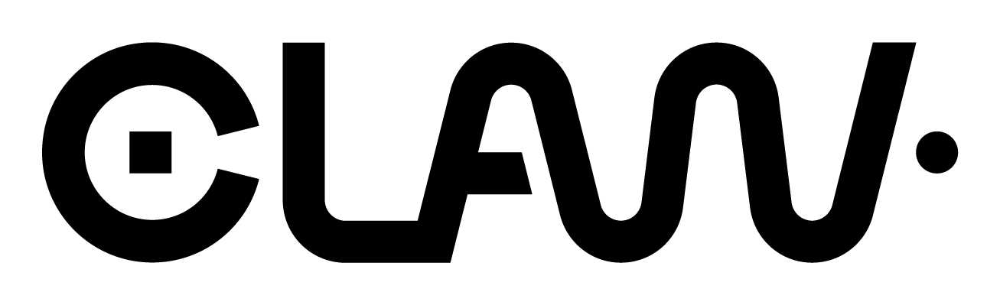
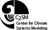

The CLAW Project is an open-source project including a directive language
specification and a reference compiler targeting performance portability in
climate and weather application written in Fortran.

## CLAW Compiler
The CLAW Compiler is a source-to-source translator working on the XcodeML
intermediate representation. It implements the necessary transformation to the
CLAW Directive Language Specifications.
Intent of this language is to achieve performance portability on weather and
climate code, especially for column- or point-wise computation.

* [**CLAW Directive Language official repository**](https://github.com/claw-project/claw-language-specification)
  * [Specification v0.4.0](./resources/claw_language_specifications_v0.4.0.pdf)

* [**CLAW Compiler official repository**](https://github.com/claw-project/claw-compiler)
  * [Releases](https://github.com/claw-project/claw-compiler/releases)

* [**CLAW Compiler - Developer's Guide v1.0**](./resources/developers_guide_v1.0.pdf)

### CLAW X2T
CLAW X2T (XcodeML to XcodeML Translator) is the part in charge of the AST
analysis and transformations based on the directives.

The [Java documentation](./javadoc/index.html) of the CLAW X2T libraries is
available.

### Contributing
The CLAW Project is welcoming contribution. More information can be found on the official
repository.
A [Slack](https://claw-compiler.slack.com/) workspace is available for discussions.

### Resources

* Plenary Talk at PASC'18: The CLAW DSL: Abstractions for Performance Portable Weather and Climate Models

  

### About
This work was initially funded by the ETH zürich and the PASC initiative under
the [ENIAC](http://www.pasc-ch.org/projects/2017-2020/eniac/) project.

---
CLAW logo by [adrienbachmann.ch](http://www.adrienbachmann.ch)
